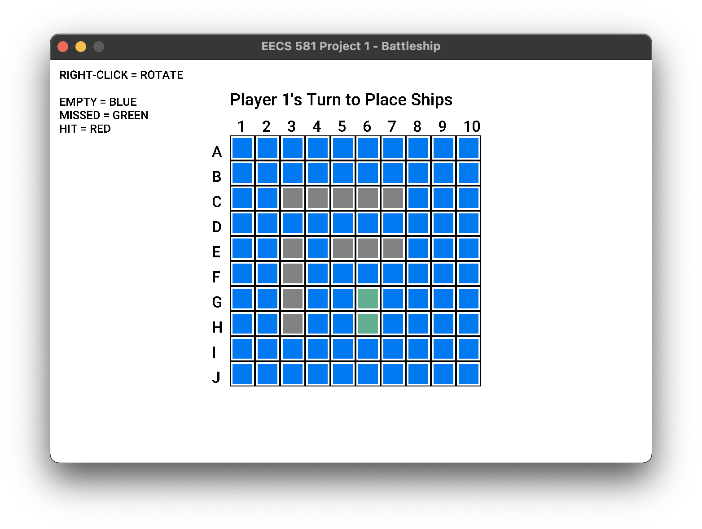

# EECS 581 Project 1 - Battleship 
A battleship game made with raylib 

## How to run it 
1) Have python and latest version of pip installed  
2) Enter root directory (where main.py is)
3) `pip install -r requirements.txt` to install raylib 
4) `python main.py` to start the game 

## Where is All the Code? 
In the battleship folder 

